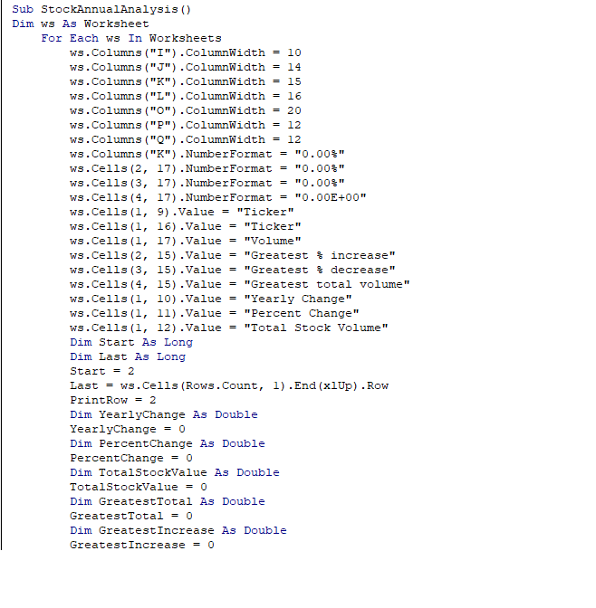

# UCB-Data-Analysis-Challenge-2
    Creator: Henry Jinghe Chen  Date: 2/15/2024
## Project Description
    The project is created for UCB Data Analysis Challenge 2.
### The Functionalities:
    *Runs on all worksheets in the workbook
    *Collects the tickers of the stocks in the worksheets
    *Calculates the yearly change of each stock in the worksheets
    *Calculates the percent change of each stock in the worksheets
    *Calculate the total stock volume of each stock in the worksheets
    *Formats the original sheets to meet the requirement that improves readability
    *Formats annual percent changes, greatest percent increase, and greatest percent decrease into percentages
    *Format the greatest total volume increase into scientific notation with two decimal places
    *Format the cells of yearly change and percent change according to increase(Green) or decrease(Red)
### Code Description

The first few lines of code actualize the function that allows the script to run through all the worksheets.
Following that, the script formats the sheets and cells.
Then, the code adds the titles.
After that, the code creates some key variables that will be used.
